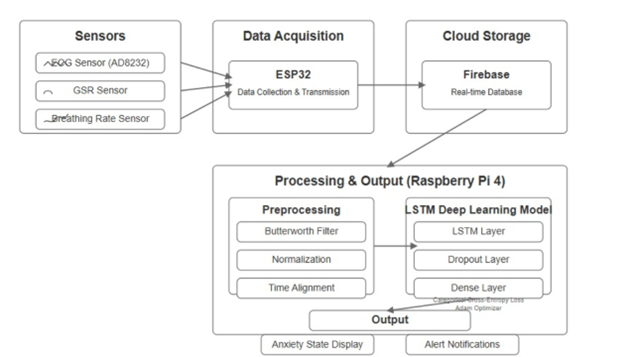
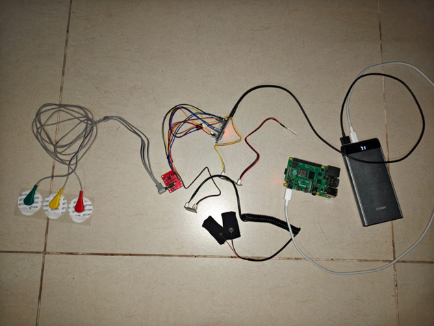
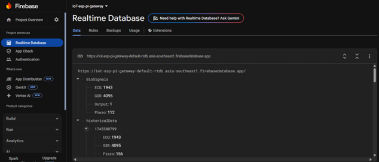
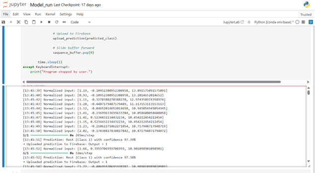

# Portable Real-Time Anxiety Detection System

An IoT-based prototype that detects anxiety in real-time using **physiological signals** (ECG, GSR, breathing rate) and a deep learning model (**LSTM**).  
Sensor data is captured by an **ESP32**, sent to **Firebase**, and processed by a **Raspberry Pi 4** running a trained LSTM model, achieving ~82% accuracy with <1s latency.

⚠️ **Note**: This is an educational prototype, not a medical device. It must not be used for clinical diagnosis.

---

## ✨ Features
- Multi-sensor monitoring (ECG, GSR, Breathing Rate)
- **ESP32**: data collection & Wi-Fi upload
- **Firebase Realtime Database**: cloud storage for live & historical data
- **Raspberry Pi 4**: LSTM inference (TensorFlow Lite)
- **Real-time classification** of anxiety vs. rest state
- Achieved **82% accuracy** with **0.8s latency**
- Portable, low-cost, scalable design

---

## 🧭 System Workflow
1. **Sensors** → AD8232 (ECG), GSR module, Piezo breathing sensor  
2. **ESP32** collects raw data and sends to Firebase via Wi-Fi  
3. **Firebase** stores both real-time and historical entries  
4. **Raspberry Pi** fetches data, preprocesses, runs LSTM model  
5. **Output**: Displays anxiety/rest state + logs results
- Architecture Diagram:  
  

---

## 🧰 Software & Tools
- ESP32 firmware (Arduino IDE + Firebase_ESP_Client, WiFiUdp, NTPClient)
- Raspberry Pi 4 (Python, TensorFlow Lite, Firebase Admin SDK)
- Firebase Realtime Database (Cloud)
- Jupyter Notebook for experiments
- LSTM model (Keras/TensorFlow) with 60 time-step input

---

## 📊 Performance
- Accuracy: **82%**
- Latency: **0.8s**
- Firebase throughput: **50 datapoints/sec**

---

## 🛠 Hardware Used
- ESP32 (WROOM-32)
- AD8232 ECG sensor
- GSR sensor
- Piezoelectric breathing sensor
- Raspberry Pi 4
- Power supply, jumper wires

---

## 🖼 Example Screenshots
- Hardware setup:  
  

- Firebase Realtime Database:  
  

- Jupyter Notebook LSTM results (on Pi):  
  

---

## 🚀 Getting Started
### Firmware (ESP32)
- Flash the Arduino sketch (`Prototype_anxiety-1.ino`)  
- Configure Wi-Fi SSID, password, Firebase URL, and API key  

### Raspberry Pi
```bash
# Install dependencies
pip install tensorflow firebase-admin requests numpy
```
- Copy trained LSTM model (`FINALanxiety_lstm_model.h5`)  
- Run the inference script (see Jupyter/Python code in docs)

---

## 👥 Contributor
- Aswin Mallessh N S (21MIS1087)   

---

## 🛡 License
MIT License – see [LICENSE](LICENSE)
